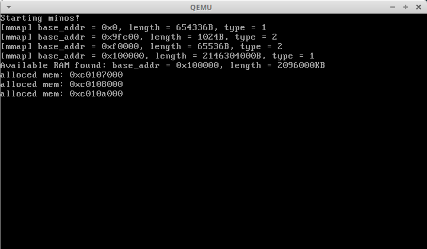

# What's this
mini os (heavily inspired by xv6)

# How to run this
```
$ make
$ make qemu
```
# Progress
- [x] enable protected mode
- [x] setup the early page table
- [x] setup IDT
- [x] setup PIC(8259A)
- [x] setup timer(8253)
- [ ] implement kernel memory allocator

# Screenshot

